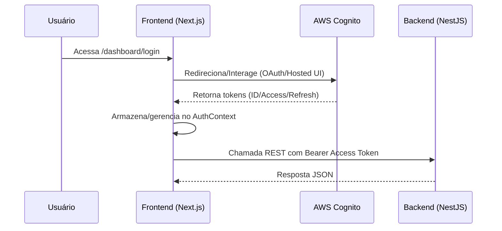

# Arquitetura — Frontend (Next.js App Router)

Visão de alto nível da arquitetura do frontend e integração com o backend e Cognito.

```mermaid
flowchart LR
  subgraph Browser
    App[Next.js App Router]
    UI[Componentes UI / A11y]
    AuthCtx[AuthContext]
    Hooks[Hooks (useAuth, useMobile, etc.)]
  end

  App --> UI
  App --> AuthCtx
  App --> Hooks

  subgraph NextInfra
    Routes[app/ pages & layouts]
    APIHelpers[lib/api & api-helpers]
    Providers[components/providers]
  end

  App --> Routes
  Routes --> Providers
  Routes --> APIHelpers
  AuthCtx --> Cognito[AWS Cognito]
  APIHelpers --> Backend[Backend NestJS API]

  subgraph Qualidade
    Tests[Jest + Testing Library]
    Coverage[Coverage]
    Sonar[SonarQube (scripts)]
  end

  App -. monitoração .-> Perf[performance-monitor]
  Tests --> Coverage

  subgraph Conteúdo
    Blog[Blog Components]
    Dashboard[Dashboard Components]
    Contato[Contato]
    Sobre[Sobre]
  end

  Routes --> Blog
  Routes --> Dashboard
  Routes --> Contato
  Routes --> Sobre

  Public[(public/ assets)] --> App
```

## Fluxo de Autenticação e Consumo de API



## Notas

- Estilos com `TailwindCSS` e tokens em `constants/design-tokens.ts`.
- Rotas em `app/` (App Router) e componentes em `components/`.
- `lib/api/` concentra integrações com o backend e utilitários.
- Scripts `sonarqube/` para análise estática e integração com Quality Gates.
