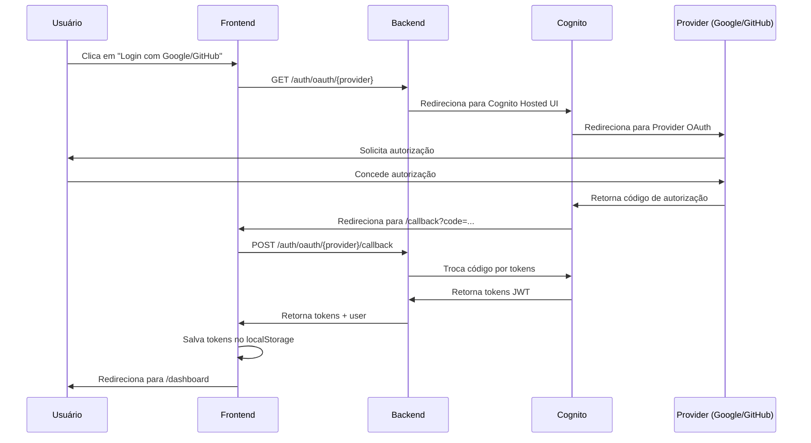

# Guia de Autenticação OAuth - Frontend

## 📋 Índice

- [Visão Geral](#visão-geral)
- [Arquitetura](#arquitetura)
- [Configuração](#configuração)
- [Fluxo OAuth](#fluxo-oauth)
- [Componentes](#componentes)
- [Hooks](#hooks)
- [Serviços](#serviços)
- [Testes](#testes)
- [Troubleshooting](#troubleshooting)

## 🎯 Visão Geral

O sistema de autenticação OAuth do frontend permite login social com **Google** e **GitHub** através do **AWS Cognito Hosted UI**. O frontend atua apenas como cliente OAuth, enquanto toda a lógica de autenticação é gerenciada pelo backend.

### Características

- ✅ Login com Google OAuth 2.0
- ✅ Login com GitHub OAuth 2.0
- ✅ Autenticação via AWS Cognito
- ✅ Tokens JWT gerenciados automaticamente
- ✅ Persistência de sessão com localStorage
- ✅ Tratamento completo de erros
- ✅ Testes unitários, integração e E2E
- ✅ Suporte a SSR (Next.js)

## 🏗️ Arquitetura

### Diagrama de Fluxo



### Componentes Principais

```
app/
├── dashboard/
│   └── login/
│       ├── page.tsx              # Página de login com OAuth
│       └── callback/
│           └── page.tsx          # Página de callback OAuth

components/
└── dashboard/
    └── login/
        └── oauth-buttons.tsx     # Botões OAuth

hooks/
└── useAuth.ts                    # Hook de autenticação

lib/
└── api/
    └── services/
        └── auth.service.ts       # Serviço de autenticação
```

## ⚙️ Configuração

### Variáveis de Ambiente

Adicione ao arquivo `.env.local`:

```env
# API Backend
NEXT_PUBLIC_API_URL=http://localhost:4000

# AWS Cognito
NEXT_PUBLIC_COGNITO_DOMAIN=your-domain.auth.us-east-1.amazoncognito.com
NEXT_PUBLIC_COGNITO_CLIENT_ID=your-client-id
NEXT_PUBLIC_COGNITO_USER_POOL_ID=us-east-1_XXXXXXXXX

# OAuth Redirect
NEXT_PUBLIC_OAUTH_REDIRECT_SIGN_IN=http://localhost:3000/dashboard/login/callback
```

### Backend Requirements

O backend deve expor os seguintes endpoints:

- `GET /auth/oauth/google?redirect_uri={uri}` - Inicia OAuth Google
- `GET /auth/oauth/github?redirect_uri={uri}` - Inicia OAuth GitHub
- `POST /auth/oauth/google/callback` - Processa callback Google
- `POST /auth/oauth/github/callback` - Processa callback GitHub

## 🔄 Fluxo OAuth

### 1. Iniciar Login OAuth

```typescript
import { useAuth } from '@/hooks/useAuth';

function LoginPage() {
  const { loginWithGoogle, loginWithGitHub } = useAuth();

  return (
    <div>
      <button onClick={loginWithGoogle}>Login com Google</button>
      <button onClick={loginWithGitHub}>Login com GitHub</button>
    </div>
  );
}
```

### 2. Redirecionamento para Provider

Quando o usuário clica em um botão OAuth:

1. **Frontend** chama `authService.loginWithGoogle()` ou `authService.loginWithGitHub()`
2. **Redireciona** para `{API_URL}/auth/oauth/{provider}?redirect_uri={callback_url}`
3. **Backend** redireciona para Cognito Hosted UI
4. **Cognito** redireciona para Provider (Google/GitHub)

### 3. Callback OAuth

Após autorização do usuário:

1. **Provider** redireciona para Cognito com código
2. **Cognito** redireciona para frontend: `/dashboard/login/callback?code=...&state=...`
3. **Frontend** extrai código e state da URL
4. **Frontend** chama `loginWithOAuthCode(code, provider, state)`
5. **Backend** troca código por tokens via Cognito
6. **Backend** retorna tokens + dados do usuário
7. **Frontend** salva tokens no localStorage
8. **Frontend** redireciona para `/dashboard`

## 🧩 Componentes

### OAuthButtons

Componente que renderiza botões de login social.

```tsx
import { OAuthButtons } from '@/components/dashboard/login';

<OAuthButtons
  onGoogleLogin={() => loginWithGoogle()}
  onGitHubLogin={() => loginWithGitHub()}
  disabled={isLoading}
/>;
```

**Props:**

- `onGoogleLogin: () => void` - Handler para login com Google
- `onGitHubLogin: () => void` - Handler para login com GitHub
- `disabled?: boolean` - Desabilitar botões durante loading
- `className?: string` - Classes CSS customizadas

### Página de Login

```tsx
// app/dashboard/login/page.tsx
export default function LoginPage() {
  const { loginWithGoogle, loginWithGitHub } = useAuth();

  return (
    <AuthLayout>
      {/* Formulário de login tradicional */}
      <LoginForm onSubmit={handleLogin} />

      {/* Separador */}
      <div>ou</div>

      {/* Botões OAuth */}
      <OAuthButtons
        onGoogleLogin={loginWithGoogle}
        onGitHubLogin={loginWithGitHub}
      />
    </AuthLayout>
  );
}
```

### Página de Callback

```tsx
// app/dashboard/login/callback/page.tsx
export default function OAuthCallbackPage() {
  const { loginWithOAuthCode } = useAuth();
  const searchParams = useSearchParams();

  useEffect(() => {
    const code = searchParams.get('code');
    const state = searchParams.get('state');

    if (code) {
      loginWithOAuthCode(code, undefined, state);
    }
  }, [searchParams]);

  return <div>Processando login...</div>;
}
```

## 🪝 Hooks

### useAuth

Hook principal para autenticação.

```typescript
import { useAuth } from '@/hooks/useAuth';

function MyComponent() {
  const {
    // Estado
    user,
    isAuthenticated,
    loading,
    error,

    // Métodos tradicionais
    login,
    register,
    logout,

    // Métodos OAuth
    loginWithGoogle,
    loginWithGitHub,
    loginWithOAuthCode,
  } = useAuth();

  return (
    <div>
      {isAuthenticated ? (
        <div>Bem-vindo, {user?.fullName}!</div>
      ) : (
        <button onClick={loginWithGoogle}>Login com Google</button>
      )}
    </div>
  );
}
```

**Retorno:**

| Propriedade          | Tipo                                            | Descrição                     |
| -------------------- | ----------------------------------------------- | ----------------------------- |
| `user`               | `UserProfile \| null`                           | Dados do usuário autenticado  |
| `isAuthenticated`    | `boolean`                                       | Se o usuário está autenticado |
| `loading`            | `boolean`                                       | Se está carregando            |
| `error`              | `Error \| null`                                 | Erro atual                    |
| `loginWithGoogle`    | `() => void`                                    | Inicia login com Google       |
| `loginWithGitHub`    | `() => void`                                    | Inicia login com GitHub       |
| `loginWithOAuthCode` | `(code, provider?, state?) => Promise<boolean>` | Processa callback OAuth       |
| `logout`             | `() => void`                                    | Faz logout                    |

## 🔧 Serviços

### AuthService

Serviço de autenticação com métodos OAuth.

```typescript
import { authService } from '@/lib/api/services/auth.service';

// Iniciar login OAuth
authService.loginWithGoogle();
authService.loginWithGitHub();

// Trocar código por tokens (via backend)
const tokens = await authService.exchangeOAuthCodeViaBackend(
  'google',
  'authorization-code',
  'state'
);

// Verificar autenticação
const isAuth = authService.isAuthenticated();

// Obter perfil do usuário
const user = await authService.getUserProfile();

// Fazer logout
authService.logout();
```

**Métodos principais:**

| Método                                                | Descrição                           |
| ----------------------------------------------------- | ----------------------------------- |
| `loginWithGoogle()`                                   | Redireciona para OAuth Google       |
| `loginWithGitHub()`                                   | Redireciona para OAuth GitHub       |
| `exchangeOAuthCodeViaBackend(provider, code, state?)` | Troca código por tokens via backend |
| `isAuthenticated()`                                   | Verifica se está autenticado        |
| `getUserProfile()`                                    | Busca perfil do usuário             |
| `logout()`                                            | Limpa tokens e faz logout           |

### Gerenciamento de Tokens

```typescript
// Obter token de acesso
const accessToken = authService.getAccessToken();

// Salvar tokens
authService.setTokens({
  accessToken: 'token',
  refreshToken: 'refresh',
  idToken: 'id-token',
  expiresIn: 3600,
  tokenType: 'Bearer',
});

// Limpar tokens
authService.clearTokens();

// Verificar se token está expirado
const expired = authService.isTokenExpired(token);
```

## 🧪 Testes

### Executar Testes

```bash
# Testes unitários
npm run test tests/components/dashboard/login/oauth-buttons.test.tsx

# Testes de página
npm run test tests/app/dashboard/login-oauth.test.tsx
npm run test tests/app/dashboard/login-callback.test.tsx

# Testes de integração
npm run test tests/integration/auth-oauth-flow.test.ts

# Testes E2E
npm run test:e2e tests/e2e/auth/oauth-login.spec.ts
```

### Cobertura de Testes

| Tipo            | Arquivo                   | Descrição                       |
| --------------- | ------------------------- | ------------------------------- |
| **Unit**        | `oauth-buttons.test.tsx`  | Testa componente OAuthButtons   |
| **Unit**        | `login-oauth.test.tsx`    | Testa página de login com OAuth |
| **Unit**        | `login-callback.test.tsx` | Testa página de callback OAuth  |
| **Integration** | `auth-oauth-flow.test.ts` | Testa fluxo completo OAuth      |
| **E2E**         | `oauth-login.spec.ts`     | Testa fluxo OAuth end-to-end    |

### Exemplo de Teste

```typescript
import { render, screen, fireEvent } from '@testing-library/react';
import { OAuthButtons } from '@/components/dashboard/login';

test('deve chamar loginWithGoogle ao clicar no botão Google', () => {
  const mockOnGoogleLogin = jest.fn();

  render(
    <OAuthButtons
      onGoogleLogin={mockOnGoogleLogin}
      onGitHubLogin={jest.fn()}
    />
  );

  const googleButton = screen.getByRole('button', {
    name: /continuar com google/i
  });

  fireEvent.click(googleButton);

  expect(mockOnGoogleLogin).toHaveBeenCalledTimes(1);
});
```

## 🔍 Troubleshooting

### Problema: Redirecionamento não funciona

**Causa:** Variáveis de ambiente não configuradas.

**Solução:**

```bash
# Verificar se variáveis estão definidas
echo $NEXT_PUBLIC_API_URL
echo $NEXT_PUBLIC_COGNITO_DOMAIN

# Reiniciar servidor Next.js
npm run dev
```

### Problema: Erro "Código OAuth inválido"

**Causa:** Código de autorização expirado ou já usado.

**Solução:**

- Códigos OAuth são de uso único
- Tentativas de reprocessar callback falharão
- Iniciar novo fluxo OAuth

### Problema: Erro "Provider não detectado"

**Causa:** State não contém informação do provider.

**Solução:**

- Backend deve detectar provider automaticamente
- State é opcional e usado apenas para melhorar UX
- Verificar logs do backend para mais detalhes

### Problema: Tokens não persistem após reload

**Causa:** localStorage não está salvando tokens.

**Solução:**

```typescript
// Verificar se tokens foram salvos
console.log(localStorage.getItem('accessToken'));

// Verificar se tokens são válidos
const isAuth = authService.isAuthenticated();
console.log('Autenticado:', isAuth);
```

### Problema: Loop infinito de redirecionamento

**Causa:** Página protegida redireciona para login, que redireciona de volta.

**Solução:**

```typescript
// Em páginas protegidas, verificar autenticação
useEffect(() => {
  if (!isAuthenticated && !loading) {
    router.push('/dashboard/login');
  }
}, [isAuthenticated, loading]);

// Em página de login, redirecionar se já autenticado
useEffect(() => {
  if (isAuthenticated && !loading) {
    router.push('/dashboard');
  }
}, [isAuthenticated, loading]);
```

## 📚 Recursos Adicionais

### Documentação

- [AWS Cognito Hosted UI](https://docs.aws.amazon.com/cognito/latest/developerguide/cognito-user-pools-app-integration.html)
- [Google OAuth 2.0](https://developers.google.com/identity/protocols/oauth2)
- [GitHub OAuth](https://docs.github.com/en/apps/oauth-apps/building-oauth-apps/authorizing-oauth-apps)

### Exemplos de Código

Veja exemplos completos em:

- `app/dashboard/login/page.tsx` - Página de login
- `app/dashboard/login/callback/page.tsx` - Callback OAuth
- `components/dashboard/login/oauth-buttons.tsx` - Botões OAuth
- `lib/api/services/auth.service.ts` - Serviço de autenticação

### Suporte

Para problemas ou dúvidas:

1. Verifique logs do console do navegador
2. Verifique logs do backend
3. Verifique configuração do Cognito no AWS Console
4. Consulte documentação do Cognito

---

**Versão:** 1.0.0  
**Última Atualização:** 2025-11-14  
**Autor:** Rainer Teixeira
