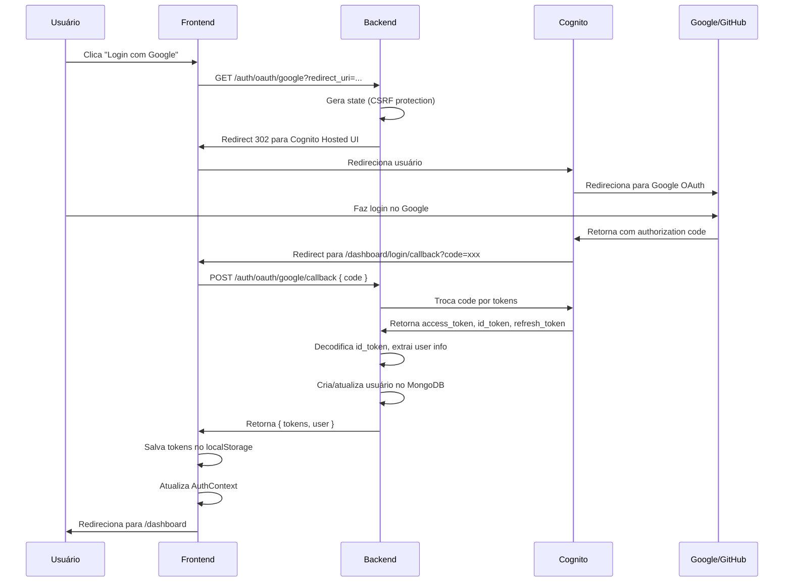

# 🔐 Guia Completo de Configuração OAuth - Google e GitHub

## ✅ Status Atual da Implementação

### Backend (NestJS)
- ✅ Endpoints OAuth implementados
  - `GET /auth/oauth/:provider` - Inicia fluxo OAuth
  - `POST /auth/oauth/:provider/callback` - Processa callback
- ✅ Integração com AWS Cognito Hosted UI
- ✅ Suporte a Google e GitHub
- ✅ Geração automática de nickname
- ✅ Sincronização com MongoDB

### Frontend (Next.js)
- ✅ Botões OAuth na página de login
- ✅ Página de callback (`/dashboard/login/callback`)
- ✅ Integração com AuthContext
- ✅ Tratamento de erros
- ✅ Redirecionamento automático

## 📋 Checklist de Configuração

### 1. AWS Cognito User Pool

#### Configurar Hosted UI
1. Acesse AWS Console → Cognito → User Pools
2. Selecione seu User Pool: `us-east-1_wryiyhbWC`
3. Vá em **App Integration** → **App client settings**
4. Configure:
   - ✅ **Enabled Identity Providers**: Google, GitHub
   - ✅ **Callback URL(s)**: `http://localhost:3000/dashboard/login/callback`
   - ✅ **Sign out URL(s)**: `http://localhost:3000`
   - ✅ **OAuth 2.0 Grant Types**: Authorization code grant
   - ✅ **OAuth Scopes**: openid, email, profile

#### Gerar Client Secret (OBRIGATÓRIO para OAuth)
1. Vá em **App Integration** → **App clients**
2. Edite seu App Client
3. Clique em **Generate client secret**
4. **COPIE O SECRET** (só é exibido uma vez!)
5. Cole no `.env` do backend:
   ```env
   COGNITO_CLIENT_SECRET=seu_client_secret_aqui
   ```

### 2. Google OAuth Configuration

#### Google Cloud Console
1. Acesse: https://console.cloud.google.com/
2. Crie um projeto ou selecione existente
3. Vá em **APIs & Services** → **Credentials**
4. Clique em **Create Credentials** → **OAuth 2.0 Client ID**
5. Configure:
   - **Application type**: Web application
   - **Name**: Rainer Portfolio
   - **Authorized JavaScript origins**:
     - `http://localhost:3000`
     - `https://rainersoft.com.br` (produção)
   - **Authorized redirect URIs**:
     - `https://us-east-1wryiyhbwc.auth.us-east-1.amazoncognito.com/oauth2/idpresponse`
     - `http://localhost:3000/dashboard/login/callback`

6. **COPIE** o Client ID e Client Secret

#### AWS Cognito - Adicionar Google
1. No Cognito User Pool, vá em **Sign-in experience** → **Federated identity provider sign-in**
2. Clique em **Add identity provider** → **Google**
3. Cole:
   - **Google app ID**: Client ID do Google
   - **Google app secret**: Client Secret do Google
   - **Authorize scope**: `profile email openid`
4. Salve

### 3. GitHub OAuth Configuration

#### GitHub Developer Settings
1. Acesse: https://github.com/settings/developers
2. Clique em **OAuth Apps** → **New OAuth App**
3. Configure:
   - **Application name**: Rainer Portfolio
   - **Homepage URL**: `http://localhost:3000`
   - **Authorization callback URL**:
     - `https://us-east-1wryiyhbwc.auth.us-east-1.amazoncognito.com/oauth2/idpresponse`
4. Clique em **Register application**
5. **COPIE** o Client ID
6. Clique em **Generate a new client secret**
7. **COPIE** o Client Secret

#### AWS Cognito - Adicionar GitHub
1. No Cognito User Pool, vá em **Sign-in experience** → **Federated identity provider sign-in**
2. Clique em **Add identity provider** → **GitHub**
3. Cole:
   - **GitHub app ID**: Client ID do GitHub
   - **GitHub app secret**: Client Secret do GitHub
   - **Authorize scope**: `read:user user:email`
4. Salve

### 4. Variáveis de Ambiente

#### Backend (`.env`)
```env
# AWS Cognito
COGNITO_USER_POOL_ID=us-east-1_wryiyhbWC
COGNITO_CLIENT_ID=3ueos5ofu499je6ebc5u98n35h
COGNITO_CLIENT_SECRET=<GERAR_NO_AWS_CONSOLE>  # ⚠️ OBRIGATÓRIO
COGNITO_REGION=us-east-1
COGNITO_ISSUER=https://cognito-idp.us-east-1.amazonaws.com/us-east-1_wryiyhbWC
COGNITO_DOMAIN=https://us-east-1wryiyhbwc.auth.us-east-1.amazoncognito.com
OAUTH_REDIRECT_SIGN_IN=http://localhost:3000/dashboard/login/callback

# Google OAuth (configurado no Cognito)
GOOGLE_CLIENT_ID=637461699994-8gj9b3vd3t1skbl9eu7b70c27ifsq0rj.apps.googleusercontent.com
GOOGLE_CLIENT_SECRET=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

# GitHub OAuth (configurado no Cognito)
GITHUB_CLIENT_ID=Ov23liDlJMbTCYQSHSOq
GITHUB_CLIENT_SECRET=fd307b98b423110a7cc9ee6c6aea54ea3c786a40
```

#### Frontend (`.env.local`)
```env
NEXT_PUBLIC_API_URL=http://localhost:4000
NEXT_PUBLIC_OAUTH_REDIRECT_SIGN_IN=http://localhost:3000/dashboard/login/callback
```

## 🧪 Como Testar

### Teste Manual

1. **Inicie backend e frontend**:
   ```bash
   # Backend
   cd c:\Desenvolvimento\rainer-portfolio-backend
   pnpm dev

   # Frontend
   cd c:\Desenvolvimento\rainer-portfolio-frontend
   pnpm dev
   ```

2. **Acesse a página de login**:
   - URL: http://localhost:3000/dashboard/login

3. **Teste Google OAuth**:
   - Clique em "Continuar com Google"
   - Deve redirecionar para tela de login do Google
   - Após login, deve voltar para `/dashboard/login/callback`
   - Deve processar e redirecionar para `/dashboard`

4. **Teste GitHub OAuth**:
   - Clique em "Continuar com GitHub"
   - Deve redirecionar para tela de login do GitHub
   - Após login, deve voltar para `/dashboard/login/callback`
   - Deve processar e redirecionar para `/dashboard`

### Verificar Logs

#### Backend
```bash
# Deve aparecer:
[AuthService] handleOAuthCallback iniciado
Provider: google, Code presente: true
[AuthService] ✅ Tokens recebidos do Cognito
[AuthService] ✅ Callback OAuth processado com sucesso!
```

#### Frontend (Console do Browser)
```bash
# Deve aparecer:
[OAuth Callback] Processando callback pela primeira vez
[OAuth Callback] Dados recebidos: { code: "abc123...", state: "presente" }
[OAuth Callback] Chamando loginWithOAuthCode...
[OAuth Callback] Resultado: sucesso
```

## 🐛 Troubleshooting

### Erro: "redirect_uri_mismatch"
**Causa**: URL de callback não está configurada corretamente
**Solução**:
1. Verifique se `http://localhost:3000/dashboard/login/callback` está em:
   - Google Cloud Console → Credentials → Authorized redirect URIs
   - GitHub OAuth App → Authorization callback URL
   - AWS Cognito → App client settings → Callback URLs

### Erro: "invalid_client"
**Causa**: Client Secret ausente ou incorreto
**Solução**:
1. Gere Client Secret no AWS Cognito Console
2. Adicione ao `.env` do backend: `COGNITO_CLIENT_SECRET=...`
3. Reinicie o backend

### Erro: "Código já foi usado"
**Causa**: Código OAuth só pode ser usado uma vez
**Solução**:
1. Faça logout
2. Inicie novo fluxo de login
3. Não recarregue a página de callback

### Erro: "Provider não configurado"
**Causa**: Google ou GitHub não estão configurados no Cognito
**Solução**:
1. Vá em Cognito → Federated identity providers
2. Adicione Google e/ou GitHub
3. Configure Client ID e Secret de cada provider

## 📊 Fluxo Completo



## ✨ Recursos Implementados

- ✅ Login com Google via Cognito
- ✅ Login com GitHub via Cognito
- ✅ Geração automática de nickname único
- ✅ Sincronização com MongoDB
- ✅ Proteção CSRF com state
- ✅ Prevenção de uso duplicado de código
- ✅ Tratamento completo de erros
- ✅ Logs detalhados para debug
- ✅ Testes E2E com Playwright

## 🚀 Próximos Passos

1. **Gerar COGNITO_CLIENT_SECRET** no AWS Console
2. **Configurar Google OAuth** no Google Cloud Console
3. **Configurar GitHub OAuth** no GitHub Developer Settings
4. **Testar fluxo completo** com ambos providers
5. **Configurar URLs de produção** quando fizer deploy

## 📝 Notas Importantes

- O OAuth é mediado pelo **AWS Cognito Hosted UI**
- Não é necessário implementar OAuth diretamente com Google/GitHub
- O Cognito gerencia todo o fluxo de autorização
- Backend apenas troca código por tokens
- Frontend apenas redireciona e processa callback
- **Client Secret é obrigatório** para fluxo authorization_code
