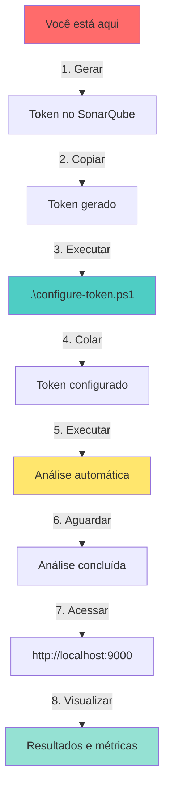

# ⚡ INSTRUÇÕES IMEDIATAS - VOCÊ ESTÁ AQUI

## 🎯 Situação Atual

Você está na tela do SonarQube que mostra:

```text
┌─────────────────────────────────────────────────────────┐
│  Forneça um token                                        │
│  ─────────────────                                       │
│                                                          │
│  Nome do token:  [_________________________]            │
│                                                          │
│  Expira em:      [1 year ▼]                             │
│                                                          │
│  [Gerar]                                                 │
│                                                          │
└─────────────────────────────────────────────────────────┘
```

---

## ✅ O QUE FAZER AGORA (3 Passos Simples)

### **PASSO 1: Gerar o Token** (Na tela do SonarQube)

1. ✍️ No campo **"Nome do token"**, digite: `portfolio-analysis`
2. 📅 No campo **"Expira em"**, deixe: `1 year` (ou escolha outra opção)
3. 🖱️ Clique no botão **"Gerar"**
4. 📋 **COPIE O TOKEN GERADO** (você só verá uma vez!)
   - O token será algo como: `squ_a1b2c3d4e5f6g7h8i9j0k1l2m3n4o5p6...`

---

### **PASSO 2: Configurar o Token** (No PowerShell)

Abra o PowerShell na pasta `sonarqube` e execute:

```powershell
# Execute este script interativo
.\configure-token.ps1
```

**O script irá:**

- ✅ Solicitar que você cole o token
- ✅ Configurar automaticamente
- ✅ Perguntar se quer salvar permanentemente
- ✅ Executar a primeira análise
- ✅ Mostrar os resultados

---

### **PASSO 3: Ver os Resultados**

Após a análise concluir, acesse:

👉 <http://localhost:9000/dashboard?id=rainer-portfolio-frontend>

Você verá:

- 🐛 **Bugs** encontrados
- 🔒 **Vulnerabilidades** de segurança
- 💡 **Code Smells** (problemas de manutenibilidade)
- 📊 **Métricas** de qualidade
- 📈 **Gráficos** de evolução

---

## 🚀 Alternativa Rápida (Manual)

Se preferir fazer manualmente:

```powershell
# 1. Configurar token (substitua SEU_TOKEN_AQUI)
$env:SONAR_TOKEN="SEU_TOKEN_AQUI"

# 2. Voltar para raiz do projeto
cd ..

# 3. Executar análise
npm run sonar:local

# 4. Aguardar conclusão (1-3 minutos)
```

---

## 📊 Exemplo de Saída Esperada

```text
INFO: Scanner configuration file: C:\...\sonar-scanner\conf\sonar-scanner.properties
INFO: Project root configuration file: .\sonar-project.properties
INFO: SonarScanner 5.0.1.3006
INFO: Java 17.0.9 Eclipse Adoptium (64-bit)
INFO: Windows 10 10.0 amd64
INFO: Analyzing on SonarQube server 10.x
INFO: Default locale: "pt_BR", source code encoding: "UTF-8"
INFO: Load global settings
INFO: Load global settings (done) | time=XXXms
INFO: Server id: XXXXXXXX-XXXX-XXXX-XXXX-XXXXXXXXXXXX
INFO: User cache: C:\Users\...\sonar\cache
INFO: Analyzing on SonarQube server 10.x
INFO: Load/download plugins
INFO: Load project settings
INFO: Project key: rainer-portfolio-frontend
INFO: Base dir: C:\Desenvolvimento\rainer-portfolio-frontend
INFO: Working dir: C:\..\.scannerwork
INFO: Load project settings (done) | time=XXXms
INFO: Indexing files...
INFO: Project configuration:
INFO:   Excluded sources: **/node_modules/**, **/*.spec.ts, ...
INFO: 123 files indexed
INFO: Quality profile for ts: Sonar way
INFO: ------------- Run sensors on module rainer-portfolio-frontend
...
INFO: Analysis total time: XX.XXX s
INFO: ------------------------------------------------------------------------
INFO: EXECUTION SUCCESS
INFO: ------------------------------------------------------------------------
```

---

## ❓ Ainda Tem Dúvidas?

### "Não tenho SonarScanner instalado"

```powershell
# Instalar com Chocolatey
choco install sonarscanner

# OU com Scoop
scoop install sonarscanner

# Verificar
sonar-scanner --version
```

### "SonarQube não está respondendo"

```powershell
# Verificar status
docker ps | Select-String sonarqube

# Iniciar se necessário
docker-compose -f docker-compose.sonarqube.yml up -d

# Aguardar 2-3 minutos
Start-Sleep -Seconds 180

# Verificar API
curl http://localhost:9000/api/system/status
```

### "Token não funciona"

1. Gere um novo token em: <http://localhost:9000/account/security>
2. Copie o token corretamente
3. Configure novamente: `$env:SONAR_TOKEN="novo-token"`

---

## 🎯 Scripts Disponíveis

Após configurar o token, você pode usar:

```powershell
# Gerenciar SonarQube
.\sonarqube.ps1 start     # Iniciar servidor
.\sonarqube.ps1 stop      # Parar servidor
.\sonarqube.ps1 status    # Ver status
.\sonarqube.ps1 analyze   # Executar análise
.\sonarqube.ps1 logs      # Ver logs
.\sonarqube.ps1 restart   # Reiniciar
.\sonarqube.ps1 help      # Ver ajuda

# NPM (na raiz do projeto)
npm run sonar:local       # Análise local
npm run sonar             # Análise padrão
```

---

## 📚 Documentação Completa

Para mais detalhes:

- **[GUIA-RAPIDO-CONFIGURACAO.md](./GUIA-RAPIDO-CONFIGURACAO.md)** - Guia detalhado desta fase
- **[docs/SONARQUBE-QUICKSTART.md](./docs/SONARQUBE-QUICKSTART.md)** - Início rápido completo
- **[docs/SONARQUBE-SETUP.md](./docs/SONARQUBE-SETUP.md)** - Setup detalhado
- **[docs/SONARQUBE-FAQ.md](./docs/SONARQUBE-FAQ.md)** - Perguntas frequentes
- **[docs/SONARQUBE-CHEATSHEET.md](./docs/SONARQUBE-CHEATSHEET.md)** - Referência rápida

---

## ✨ Resumo do Fluxo



---

## 🎉 Próximos Passos (Após Configurar)

1. ✅ Executar análises regularmente: `.\sonarqube.ps1 analyze`
2. ✅ Revisar e corrigir issues reportados
3. ✅ Configurar Quality Gates (opcional)
4. ✅ Integrar com CI/CD (opcional)
5. ✅ Instalar SonarLint no VS Code (opcional)

---

**🚀 COMECE AGORA!**

Execute na pasta `sonarqube`:

```powershell
.\configure-token.ps1
```

---

**Última atualização:** 13/10/2025  
**Autor:** Rainer Teixeira  
**Versão:** 1.0.0
